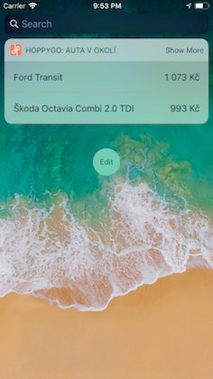
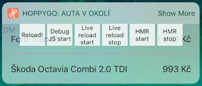

# React Native Today Widget
> Experimental library investigating limits of implementation iOS App Extensions using React Native.

Sample result from [Complex](https://github.com/matejkriz/react-native-today-widget/tree/master/Examples/Complex) example:



What is [Today Widget](https://developer.apple.com/ios/human-interface-guidelines/extensions/widgets/)?

## Getting started

This library will help you to add iOS Today Widget App Extension without need to open XCode.

### Dependencies

- `xcodeproj` for linking script:
```bash
$ gem install xcodeproj
```
You may need to use `sudo gem install xcodeproj` or `sudo gem install -n /usr/local/bin xcodeproj` depends on your Ruby installation.

- For React Native compatibility, check peerDependencies in [package.json](./package.json#L50)

### Setup

```bash
$ yarn add react-native-today-widget
$ react-native link
```
You could use `$ npm i react-native-today-widget --save` as well, but don't forget to save it in `package.json` dependencies. Otherwise RN will not link it.

> Whenever you change Bundle Identifier (CFBundleIdentifier) for main app, you have to run `./node_modules/.bin/bundle-id` script or reinstall the module (`rm -rf node_modules/react-native-today-widget && yarn`)

#### Manual linking
`react-native link` should works, but in case of some troubles, you could follow [general guide for linking libraries](https://facebook.github.io/react-native/docs/linking-libraries-ios.html#manual-linking).

- file for [Step 1](https://facebook.github.io/react-native/docs/linking-libraries-ios.html#step-1) is `/node_modules/react-native-today-widget/ios/RNTodayWidgetExtension.xcodeproj`
- as a [Step 2](https://facebook.github.io/react-native/docs/linking-libraries-ios.html#step-2), add `TodayWidgetExtension.appex` to Embedded Binaries on the General tab for your main target
- in [Step 3](https://facebook.github.io/react-native/docs/linking-libraries-ios.html#step-3), add `$(SRCROOT)/../node_modules/react-native-today-widget/ios/TodayWidgetExtension` to Header Search Paths


### Usage

All you need is to create an index.widget.js at the root and register your component for key `TodayWidgetExtension` in your `index.widget.js`

```jsx
const TodayWidget = () => (
  <View>
    <Text>
      Hello Today Widget!
    </Text>
  </View>
);

AppRegistry.registerComponent('TodayWidgetExtension', () => TodayWidget);
```
### Note
please note that registering the widget and the app in index.js file can cause memory issues. 
because the app is also bundled (even if you don't need it in your app), and it causes 'Unable to load' errors.
when we devide it to 2 different files, the widget and the app, are bundled seperately.

In place of `TodayWidget` component, you could use any JSX component. See [Basic example](./Examples/Basic/index.ios.js#L34).

Run your app as usual:
```bash
react-native run-ios
```

Display new widget on Search screen or by force touch on your app icon (on devices supporting 3D Touch).

If you need to see logs from TodayWidgetExtension, use:
```bash
react-native log-ios
```
> In your extension scheme’s Run phase, you specify a `host app` as the executable

### Memory limitation
The memory limit for Today Widget on device is 16 MB. (Great explanation is in this [talk by Conrad Kramer](https://cocoaheads.tv/memory-use-in-extensions-by-conrad-kramer/))

Verified experimentally using [XCode debugger](https://developer.apple.com/library/content/documentation/DeveloperTools/Conceptual/debugging_with_xcode/chapters/debugging_tools.html#//apple_ref/doc/uid/TP40015022-CH8-SW16) - while loading big image, Today Widget crashes as soon as it reaches 16 MB memory usage.

Memory usage of [Basic](https://github.com/matejkriz/react-native-today-widget/tree/master/Examples/Basic) example with just one Text element is about 11 MB. Up to 13 MB during content rendering.

> For running Today Widget on device you have to use [`Release` build configuration](http://facebook.github.io/react-native/releases/0.48/docs/running-on-device.html#2-configure-release-scheme). Development mode adds too much overhead. Only possibility to run the widget on device in development mode is using [Instruments](https://developer.apple.com/library/content/documentation/DeveloperTools/Conceptual/InstrumentsUserGuide/index.html#//apple_ref/doc/uid/TP40004652-CH3-SW1) tool to temporarily disable the limit.


### Notes
- Every native change on widget project is only in `node_modules` so probably gitignored!
- For recommended transparent background simply don't set any `backgroundColor` for your Today Widget component.
- [Human Interface Guidelines](https://developer.apple.com/ios/human-interface-guidelines/extensions/widgets/)
- More about: [iOS App Extensions](https://developer.apple.com/app-extensions/)
- [Today Widget in App Extension Programming Guide](https://developer.apple.com/library/content/documentation/General/Conceptual/ExtensibilityPG/Today.html#//apple_ref/doc/uid/TP40014214-CH11-SW1)

To investigate more iOS App Extensions with React Native check those:
- [react-native-share-extension](https://github.com/alinz/react-native-share-extension)
- [react-native-share-menu](https://github.com/meedan/react-native-share-menu)
- [Messages App/App Extension (iOS10) with React Native](https://medium.com/rendez-voo/messages-app-app-extension-ios10-with-react-native-6d22ece64598)


### API Reference

#### `DevMenu`
Default dev menu is not available in widget, but you could use `DevSettings` from `NativeModules` or this prepared `DevMenu` component to enable Live/Hot reload or remote JS debugging.

- `children` - trigger element (TouchableOpacity by default)
- `style` - overriding default style for trigger element
- `title` - set trigger text ('DM' by default)

##### Example
```jsx
import { DevMenu } from 'react-native-today-widget';

const TodayWidget = () => (
  <View>
    <Text>Hello Today Widget!</Text>
    {__DEV__ && <DevMenu />
      /* Has to be a last element to be clickable,
      because it has absolute position */
    }
  </View>
);
```

Screenshot of opened Developer Menu:



#### `openURL([url:string])`
Asks the system open a URL on behalf of the currently running app extension.

- `url` - the URL to open

> If you employ this method to open other apps from your widget, your App Store submission might entail additional review to ensure compliance with the intent of widgets.

#### `setExpandable([expandable:boolean = true], [maxHeight:number = 110])`
Enables to display native Show More / Less button in top right corner of the widget (iOS 10).

- `expandable` - if `false` Show More / Less button is hidden
- `maxHeight` - height of expanded widget

Height of collapsed Today Widget is always 110px on iOS 10.

##### Example
```jsx
import { setExpandable } from 'react-native-today-widget';

const TodayWidget = () => {
  const isExpandable = true;
  const maxHeight = 500;
  setExpandable(isExpandable, maxHeight);
  const onLayout = (event) => {
    const height = event.nativeEvent.layout.height;
    if (height <= 110) {
      console.log('widget is in compact mode');
    }
    else if (height > 110) {
      console.log('widget is in expanded mode');
    }
  }
  return (
    <View onLayout={onLayout}>
      <Text>
        Hello Today Widget!
      </Text>
    </View>
  );
};
```

You could try [Expandable example](./Examples/Expandable)
